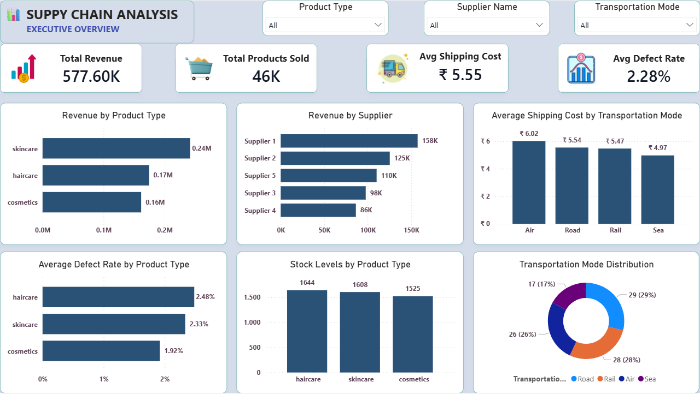

# 🚚 Supply Chain Analytics Dashboard

)

## 📌 Project Overview

This End-to-End Supply Chain Analytics project analyzes inventory performance, supplier efficiency, logistics operations, and profitability using Python, SQL, and Power BI.

The project transforms raw supply chain data into actionable business insights through data cleaning, exploratory data analysis (EDA), SQL analysis, and interactive dashboards.

---

## 🎯 Business Objectives

- Analyze inventory and stock performance
- Evaluate supplier productivity and quality
- Monitor shipping costs and logistics efficiency
- Identify product defect trends
- Track profitability across product categories
- Support data-driven business decisions

---

## 🛠️ Tools & Technologies

- Python (Pandas, NumPy, Matplotlib, Seaborn)
- PostgreSQL (SQL)
- Power BI
- Excel

---

## 📊 Dashboard Pages

### 1️⃣ Executive Overview

- Revenue Analysis
- Product Performance
- Supplier Performance
- Shipping Cost Analysis
- Defect Rate Monitoring



---

### 2️⃣ Inventory & Supplier Analysis

- Stock Level Analysis
- Production Volume Tracking
- Supplier Performance Evaluation
- Quality Inspection Analysis
- Defect Rate Assessment


---

### 3️⃣ Logistics & Profitability Analysis

- Transportation Cost Analysis
- Shipping Time Analysis
- Lead Time Evaluation
- Profit Margin Analysis
- Logistics Performance Monitoring


---

### 4️⃣ Business Insights & Recommendations

- Executive Summary
- Key Findings
- Strategic Recommendations
- Business Improvement Opportunities


---

## 📈 Key Insights

- Skincare products generated the highest revenue.
- Supplier 1 contributed the highest overall revenue.
- Haircare products maintained the highest inventory levels.
- Supplier 2 achieved the highest production volume.
- Supplier 5 recorded the highest defect rate.
- Air transportation incurred the highest shipping cost.
- Cosmetics products delivered the highest profit margin.

---

## 🔄 Project Workflow

```text
Raw Data
    ↓
Data Cleaning (Python)
    ↓
Exploratory Data Analysis (EDA)
    ↓
Feature Engineering
    ↓
SQL Analysis (PostgreSQL)
    ↓
Power BI Dashboard Development
    ↓
Business Insights & Recommendations
```

---

## 📁 Project Structure

```text
Supply-Chain-Analytics-Dashboard
│
├── Dataset
│   ├── supply_chain_raw.csv
│   └── supply_chain_clean.csv
│
├── Python
│   ├── data_cleaning.ipynb
│   └── eda.ipynb
│
├── SQL
│   └── supply_chain_analysis.sql
│
├── PowerBI
│   └── Supply_Chain_Analytics.pbix
│
├── Dashboard Sceenshots
│   ├── 1_Executive_Overview.png
│   ├── 2_Inventory_Supplier_Analysis.png
│   ├── 3_Logistics_Profitability_Analysis.png
│   └── 4_Business_Insights.png
│
└── README.md
```

---

## 🚀 Skills Demonstrated

- Data Cleaning
- Exploratory Data Analysis (EDA)
- Feature Engineering
- SQL Querying
- Data Visualization
- Dashboard Development
- Business Intelligence
- Supply Chain Analytics
- KPI Analysis
- Data Storytelling

---

## 👤 Author

**Pritam Patil**

Aspiring Data Analyst | SQL | Power BI | Python | Excel | Business Intelligence

---

### ⭐ If you found this project useful, consider giving it a star.
